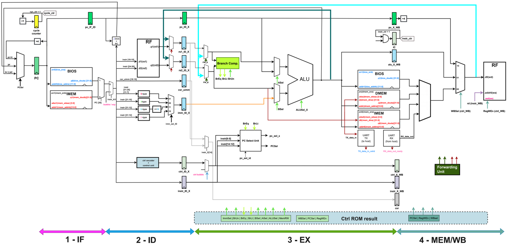

Four-Stage Pipelined RISC-V CPU with UART
=======================================================
Implemented using Verilog
Targeted platform: Xilinx Zynq 7000-series FPGA

Authors: Alexander Volkov, Anastasia Simonova

